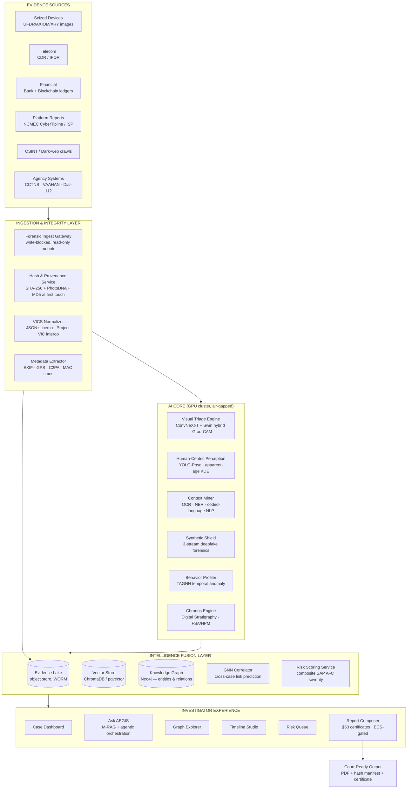
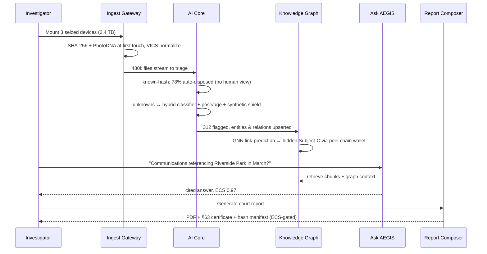

# AEGIS — Solution Architecture (Chief Architect Blueprint)
### AI Evidence & Guardianship Intelligence System — HACK-KP 2026
> *"From terabytes to testimony — in hours, not months."*

---

## 🗣️ In plain words
- This document is the technical blueprint: how all the pieces of AEGIS fit together, like a building's floor plan.
- Evidence flows through a pipeline: take it in → fingerprint-seal it → let AI sort and analyze it → connect the dots → show investigators → print a court-ready report.
- The whole system runs inside the police agency with **no internet connection** — evidence physically cannot leak out.
- The AI only *suggests*; a human always makes the final call, and the AI must show *why* it flagged anything (a highlighted heat map).
- One section (§6) honestly lists what's real in our demo (the app) vs. simulated (the AI's verdicts).
- Every acronym here is explained in plain English in `LAYMAN-GUIDE.md`.

## 1. Architecture Vision & Principles

| # | Principle | Meaning | Consequence in design |
|---|-----------|---------|----------------------|
| P1 | **Sovereign & air-gapped** | No evidence ever leaves agency premises | Local LLMs (Llama 3.x / DeepSeek-R1), on-prem vector DB, Zero-Trust (UZTNA) internal mesh |
| P2 | **Court-admissible by design** | Every AI output must survive cross-examination | SHA-256 at ingest, BSA 2023 §63 auto-certificates, VICS interop, HERAM/ECS gating of generated text |
| P3 | **Human-in-the-loop, AI-in-the-lead** | AI triages & proposes; humans decide | Confidence thresholds route to review queues; XAI (Grad-CAM/LIG) on every classification |
| P4 | **Investigator wellbeing first** | Minimize traumatic exposure | Blur-by-default, severity-sorted queues, "no-view" workflows for known-hash matches (~91% exposure reduction) |
| P5 | **Zero-day ready** | Cannot rely on hash matching alone | Semantic vision models + synthetic-content forensics as first-class pipelines |
| P6 | **Fusion, not silo** | One graph across devices, finances, telecom, OSINT | Canonical entity model + GNN over a unified knowledge graph |

---

## 2. High-Level Architecture (HLD)

**Trust boundary:** everything inside INGEST→EXPERIENCE runs inside the agency's Zero-Trust enclave. mTLS between services; per-investigator RBAC scoped to warrant/case ID; full audit log (append-only) of every query and view.

---

## 3. Module-Level Design (LLD) — the 12 Innovation Areas

### 3.1 Content Analysis — *Visual Triage Engine*
- **Pipeline:** file carve → known-hash check (PhotoDNA/Project VIC — instant "no-view" disposition) → hybrid classifier for unknowns.
- **Model:** ConvNeXt-Tiny backbone (local texture) + Swin Transformer head (global semantics); trained via transfer learning on benign human-centric tasks + restricted lawful datasets; **never trained on illicit material directly** (legal/ethical constraint).
- **XAI:** Grad-CAM + Layer-wise Integrated Gradients rendered as heat overlays → stored alongside verdict for court explainability.
- **Output:** `{class, confidence, category A/B/C, xai_map_ref, model_version}` — model version pinned per case for reproducibility.

### 3.2 Threat Identification — *Human-Centric Perception*
- YOLO-Pose skeletal keypoints + body-part bounding boxes (BKPD-style representation).
- **Age estimation as label-distribution learning** (KDE over annotator distributions → apparent-age PDF, not a point estimate) — reduces MAE, gives defensible uncertainty bands ("apparent age 9–12, p=0.94").
- Pose semantics: coercion/restraint indicators from inter-subject spatial relations, robust to clothing obfuscation.

### 3.3 Source Correlation — *GNN Correlator*
- **Canonical entity model:** `Person, Device, Account, Wallet, IP, MediaHash, Location, Event`.
- Edges: `COMMUNICATED, TRANSACTED, POSSESSED, SHARED_HASH, CO_LOCATED, LOGGED_IN_FROM`.
- TAGNN link-prediction surfaces latent connections (e.g., unknown third party bridged by a peel-chain wallet + shared media hash).
- Cross-case: hash & wallet nodes are global → automatic multi-case syndicate discovery.

### 3.4 Contextual Extraction — *Context Miner*
- OCR (screenshots, receipts, signage in images) → text lane.
- NLP: NER (aliases, handles, locations), grooming-pattern classifiers, **coded-language lexicon** matching (P2P filename taxonomies, slang drift handled by embedding similarity, not exact match).
- Every extraction carries `source_file + offset` for citation.

### 3.5 Activity Pattern Analysis — *Behavior Profiler*
- Transformer-autoencoder over event streams (network bursts, file creation, wiping-tool execution, browser deletions).
- Flags anomalous behavioral clusters (e.g., late-night encrypted P2P burst → media creation → anti-forensics) as **high-value temporal windows** for examiner deep-dive.

### 3.6 Metadata Mapping — *Provenance Mapper*
- EXIF/GPS/cell-tower/device-serial extraction; C2PA manifest validation.
- All normalized into **VICS JSON** → lossless interop with Cellebrite, Magnet, Griffeye, Project VIC ecosystems.
- Device fingerprinting: sensor-pattern noise (PRNU) as stretch goal to bind media → camera.

### 3.7 Synthetic Detection — *DeepFake Shield*
Three parallel streams, fused:
| Stream | Backbone | Catches |
|---|---|---|
| Global texture | LoRA-adapted DINOv2-G | illumination/compression mismatches |
| Localized facial | cascaded-recovery geometry net | face-swap structural artifacts |
| Semantic fusion | frozen CLIP-L | logical impossibilities (anatomy, floating objects) |
Plus: **defocus-blur physics map** (lens-optics consistency) and **A/V sync matrix** for video (diagonal activation = genuine).
- Output feeds legal disposition: synthetic CSAM is still criminal in most jurisdictions, but verdict changes victim-ID workflows.

### 3.8 Timeline Reconstruction — *Chronos Engine*
- **Digital Stratigraphy:** events as tuples ⟨time, frequency, interaction-pattern, layer⟩; Forensic Sequence Alignment scores align asynchronous multi-device logs; adaptive weights learned per case.
- Clock-skew correction across devices; manipulated-timestamp detection (stratigraphic inconsistency = anti-forensics flag).
- Output: layered, court-presentable phase timeline (grooming → production → distribution).

### 3.9 Intelligent Retrieval — *Ask AEGIS*
- **M-RAG:** semantic chunking → all-MiniLM-L12-v2 embeddings → ChromaDB → top-k injection into local Llama 3.x context.
- **Agentic orchestration:** Master agent decomposes queries → sub-agents (Graph agent/Cypher, SQL agent, Vision agent, Timeline agent) → answers assembled **with mandatory citations to evidence IDs**.
- Region-level RAG for image queries ("find images near this landmark").

### 3.10 Automated Reporting — *Report Composer*
- Templates: triage summary, forensic report, **BSA 2023 §63 dual-part certificate** (Part A source identification auto-filled from ingest metadata: IMEI/serial/extraction env; Part B hash attestation).
- **HERAM hallucination gate:** every generated sentence scored (RAG-discrepancy + perplexity anomaly + token-distribution profiling) → Evidence Confidence Score; below-threshold text is flagged/excluded. Reports ship with ECS appendix.

### 3.11 Risk Assessment — *Lead Prioritizer*
- Composite score = f(content severity A–C, apparent-age estimate, recency, active-abuse indicators, victim-identifiability, network centrality of suspect).
- **Escalation SLA:** "possible ongoing abuse" leads jump the queue with countdown timers; auto-notify supervisor.

### 3.12 Intelligence Fusion — *Fusion Center*
- Air-gapped lake joining device extractions with CCTNS, VAAHAN, Dial-112, CDR/IPDR, bank + **blockchain forensics** (address clustering, mixer/peel-chain heuristics, off-ramp exchange identification → subpoena targets).

---

## 4. Data Flow — "Operation Sentinel" sequence

---

## 5. Deployment & Security Architecture

| Layer | Choice | Rationale |
|---|---|---|
| Compute | On-prem GPU node(s) (e.g., 2×A100/L40S) + CPU workers | air-gap; batch triage throughput |
| Orchestration | Kubernetes (offline registry) or docker-compose for pilot | reproducible, portable to agency DC |
| Storage | MinIO (WORM buckets) for evidence; Postgres+pgvector or ChromaDB; Neo4j | immutability, semantic + graph queries |
| LLM | Llama 3.x 8B/70B quantized, vLLM served locally | no external API = no data egress |
| Identity | Keycloak + hardware keys; per-case RBAC; warrant-scoped views | least privilege, UZTNA |
| Audit | Append-only log (immudb style), every view/query recorded | chain of custody incl. *who saw what* |
| Adversarial hardening | detect-then-classify front filter, adversarial retraining, feature squeezing | FGSM/C&W evasion resistance |

---

## 6. What is REAL vs MOCKED in the hackathon demo

| Component | Demo status | How mocked |
|---|---|---|
| Investigator console (8 views) | **Real UI** (React) | fully interactive, synthetic data |
| Triage/pose/age/synthetic verdicts | Mocked | precomputed rich JSON, plausible confidences |
| Entity graph | Real force-graph UI | curated 25–40 node case graph |
| Ask AEGIS | Mocked RAG | scripted Q&A + typewriter effect + citations (optionally real local RAG as stretch) |
| §63 report | Real generated document | template + real SHA-256 of mock files |
| Hash/ingest pipeline | Simulated progress | animated ingest with believable throughput numbers |

Judges' rubric rewards a working demo — the **console is genuinely working software**; the AI verdicts are simulated with research-grounded realism, and we say so honestly ("model integration is roadmap; architecture is validated by literature").

---

## 7. Ethics & Legal Guardrails (state on slide + in video)
1. Authorized agencies only; warrant-scoped access; full audit trail.
2. No training on illicit material — synthetic data, transfer learning, restricted lawful datasets.
3. Human decision on every consequential action; AI never auto-accuses.
4. Bias monitoring on age/ethnicity performance; uncertainty always displayed.
5. Wellbeing: exposure minimization is a design KPI, not an afterthought.
