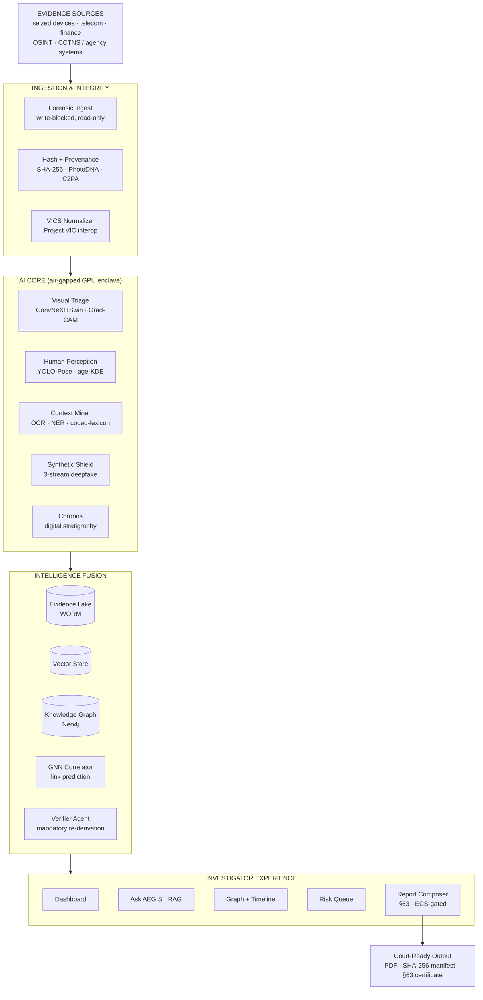

<div align="center">

# 🛡️ AEGIS-X

### AI Evidence & Guardianship Intelligence System

**_From terabytes to testimony — in hours, not months._**

AEGIS-X is a high-fidelity, interactive demo of a **sovereign, air-gapped, AI-powered
child-protection investigation platform** — the console an authorized agency would use to take
seized evidence from *ingest → analyze → correlate → prioritize → court-ready report*. It runs
a fictional case, **KP-2026-0417 · "Operation Sentinel"**, end-to-end in your browser.

`React 19` · `Three.js / R3F` · `Vite` · `TailwindCSS` · `100% Fictional Data Only` · `HACK-KP 2026`

> ⚠️ **Wizard-of-Oz prototype.** The console is genuinely working software; the AI verdicts are
> *simulated* with research-grounded realism (and we say so — see [§ Honesty](#-honesty-note)).
> **All data is 100% fictional/synthetic.** No real names, no real imagery, no explicit content.

</div>

---

## ⚡ 60-second quickstart

**Runs on any laptop.** The only prerequisite is **Node ≥ 20** (developed on Node v24) — no GPU,
no database, no internet at runtime (all fonts/assets are bundled).

**Windows (PowerShell):**
```powershell
git clone https://github.com/SanjayS-007/hack-kp-2026.git
cd hack-kp-2026\prototype
npm install
npm run dev
# → open http://localhost:5173
```

**macOS / Linux (bash/zsh):**
```bash
git clone https://github.com/SanjayS-007/hack-kp-2026.git
cd hack-kp-2026/prototype
npm install
npm run dev
# → open http://localhost:5173
```

Prefer the production build for a demo (no dev-server hiccups):
```bash
npm run build       # outputs prototype/dist/
npm run preview     # serves the build → http://localhost:4173
```

### Troubleshooting

| Symptom | Fix |
|---|---|
| **Port 5173 already in use** | `npm run dev -- --port 5273` (any free port), then open that URL |
| **No WebGL / old GPU** | Append `?flat` to the URL (e.g. `http://localhost:5173/?flat`) → the 2D card-grid vault replaces the 3D world |
| **Slow machine / stutter** | Enable your OS **"reduce motion"** setting — AEGIS-X honors `prefers-reduced-motion` (camera cuts instead of flies, no bloom, static particles) |
| **Blank 3D canvas on first load** | Refresh the page once (WebGL context occasionally needs a second init) |
| **Need a clean slate between takes** | Append `?reset` to any URL to hard-clear all session state |

---

## 🎬 2-minute guided demo

Press **`D`** (or click **▶ Demo** in the Vault hero) to start the presenter-driven journey. A pulsing
**spotlight** marks the next click-target; your **real click** advances it — nothing auto-navigates
between phases. Controls: **`►` / `→`** force-advance · **speed slider 0.5×–2×** (or **`[`** / **`]`**) ·
**`Space`** pause · **`Esc`** exit · append **`?reset`** to restart clean.

The 22-beat journey (each beat = one spotlighted click):

| # | Chapter | Beat — what you see |
|---|---------|---------------------|
| 1 | **Genesis** | **New Case** → opens the intake wizard |
| 2 | Genesis · Acquire | Drag the **seizure bundle** → seals SHA-256 onto every file |
| 3 | Genesis · Acquire | **Begin Ingestion** → Process + AI Core lanes auto-run (~15s) |
| 4 | Genesis · Analyze | **Create Case Vault** → integrity report, chain-of-custody UNBROKEN |
| 5 | Genesis · Seal | **Name the case** (the only typing in the demo) |
| 6 | Genesis · Seal | **Seal into Vault** → number mints to KP-2026-0417, lock ceremony |
| 7 | Console | **Open the sealed case** → enter the Dashboard |
| 8 | Ask AEGIS | **Ask AEGIS** nav → the RAG centerpiece |
| 9 | Ask AEGIS | **Ask about Subject-B** → agent-trace (Cypher + ms) + cited answer + ECS |
| 10 | Entity Graph | **Entity Graph** nav → the fusion knowledge graph |
| 11 | Entity Graph | **Run GNN Link Prediction** → reveals hidden **Subject-C** |
| 12 | Synthetic | **Synthetic Detection** nav → DeepFake Shield |
| 13 | Synthetic | **Re-analyze** → 3-stream verdict AI-GENERATED 98.2% |
| 14 | Court Report | **Court Report** nav → automated §63 reporting |
| 15 | Court Report | **Generate report** → HERAM 41/42 grounded, 1 excluded |
| 16 | Fusion Vault | **Back to the Vault** → pull back to the 3D Fusion Vault |
| 17 | Fusion Vault | **Fusion View** → cross-case threads arc between islands |
| 18 | Fusion Vault | **Open the gold thread** → shared wallet cluster · 0.91 |
| 19 | Fusion Vault | **Propose joint investigation** → JOINT-2026-0091 |
| 20 | Fusion Vault | **Rise to the Intelligence Crown** → risk proof opens |
| 21 | Fusion Vault | **Compile Case Report** → dive the strata, citations land in the doc |
| 22 | Seal | **Sign & Seal** → signatures fill, DRAFT watermark dissolves, crown flips green |

---

## 🧭 The problem & the solution

- **The problem:** child-abuse investigations drown in evidence — a single case can hold **480,000+
  files** across seized devices; forensic backlogs run **6–18 months** (25,000+ devices queued in UK
  forces alone) while a child may still be in harm.
- **The trauma tax:** **10–40% of investigators** show PTSD / secondary-trauma symptoms from viewing
  the material by hand.
- **Hashing isn't enough:** PhotoDNA matches only *known* images — blind to **zero-day** and
  **AI-generated** abuse content (reports of which rose ~380–1,325% in 2024).
- **The solution:** AEGIS-X reads the whole "library" overnight, **blurs disturbing material by
  default** (~91% less human exposure), and sorts everything into *harmless / suspicious / urgent*.
- **It connects the dots:** one fusion graph across people, devices, crypto peel-chains, telecom and
  OSINT surfaces a hidden suspect no human spotted, then reconstructs a day-by-day timeline.
- **It holds up in court:** every finding carries a tamper-proof SHA-256 "wax seal", a hallucination
  score (ECS), and an auto-filled **BSA 2023 §63** certificate — *terabytes to testimony in hours.*

---

## 🗺️ The 12 challenge areas → module map

| # | Innovation area | AEGIS-X module | Console route |
|---|-----------------|----------------|---------------|
| 1 | Content Analysis | Visual Triage Engine | `/triage` |
| 2 | Threat Identification | Human-Centric Perception | `/aicore` (Lane A) |
| 3 | Source Correlation | Entity Graph / GNN Correlator | `/graph` |
| 4 | Contextual Extraction | Context Miner (OCR · NER) | `/aicore` (Lane B) |
| 5 | Activity Pattern Analysis | Behavior Profiler (TAGNN) | `/aicore` (Lane C) |
| 6 | Metadata Mapping | Provenance Mapper (EXIF · C2PA · VICS) | `/genesis` · `/report` |
| 7 | Synthetic Detection | DeepFake Shield (3-stream) | `/synthetic` |
| 8 | Timeline Reconstruction | Chronos Engine (digital stratigraphy) | `/timeline` |
| 9 | Intelligent Retrieval | Ask AEGIS (multimodal RAG) | `/ask` |
| 10 | Automated Reporting | Court-Ready Reports (§63 · ECS) | `/report` |
| 11 | Risk Assessment | Lead Prioritizer (SAP A–C) | `/queue` |
| 12 | Intelligence Fusion | Fusion Center (air-gapped lake) | `/` (Fusion Vault 3D) |

---

## 🏛️ Architecture

Evidence flows through one air-gapped pipeline — *ingest → seal → AI triage → fuse → present →
court-ready output.* Everything runs inside the agency's Zero-Trust enclave; the AI only *proposes*,
a human always decides, and every classification ships with an explainable heat-map.



- **Ingestion & Integrity** — write-blocked capture; SHA-256 + provenance sealed *at first touch*; normalized to VICS for interop.
- **AI Core** — parallel inference lanes (visual, language, temporal) with explainable overlays; ~78% of files auto-disposed, never seen by a human.
- **Intelligence Fusion** — WORM evidence lake + vector store + knowledge graph; a GNN predicts hidden links; a **Verifier Agent** re-derives every claim before an investigator sees it.
- **Investigator Experience** — the 8-view console: dashboard, triage, graph, timeline, Ask AEGIS, risk queue, and the court-ready report.

> Full blueprint (LLD per module, deployment, security, ethics): **[`ARCHITECTURE.md`](ARCHITECTURE.md)**.
> The elevated "billion-dollar" vision (agentic swarm, provenance spine, federated network):
> **[`VISION-AEGIS-X.md`](VISION-AEGIS-X.md)**.

---

## 📂 Repo map

| Path | What's inside |
|---|---|
| **[`prototype/`](prototype/)** | The React 19 + Vite demo console (the runnable submission) — see [`prototype/README.md`](prototype/README.md) |
| **[`deck/`](deck/)** | Pitch deck (`AEGIS-pitch.pptx`) + `build_deck.py` generator + screenshot `shots/` |
| **[`video/`](video/)** | Demo-video assets: `video-script.md`, `storyboard.md`, `shot-list.md`, `voiceover-only.txt` |
| **[`research/`](research/)** | Deep research: `competitive-and-pitch-notes.md`, `business-case.md`, `frontier-ai.md`, `security-frontier.md` |
| **[`diagrams/`](diagrams/)** | `aegis-x-flow.eraser` source flow diagram |
| **[`audit/`](audit/)** | Playwright screenshot passes + `FLOW-CONTINUITY-AUDIT.md` (canon cross-check) |

**Key spec docs**

| Doc | Purpose |
|---|---|
| [`CONCEPT-BRIEF.md`](CONCEPT-BRIEF.md) | The one-page concept, 12 modules, demo storyline, mock-data rules |
| [`ARCHITECTURE.md`](ARCHITECTURE.md) | Chief-Architect blueprint (HLD + LLD + real-vs-mock table §6) |
| [`VISION-AEGIS-X.md`](VISION-AEGIS-X.md) | The elevated billion-dollar vision & five moats |
| [`MASTER-FLOW-PLAN.md`](MASTER-FLOW-PLAN.md) | The single source of truth for how every phase chains together |
| [`LAYMAN-GUIDE.md`](LAYMAN-GUIDE.md) | "Explain it like I'm 12" — plain-English glossary of every term |
| [`REPORT-AND-FINALCUT.md`](REPORT-AND-FINALCUT.md) | Court-report spec + final video/deck plan |
| [`DESIGN-SYSTEM.md`](DESIGN-SYSTEM.md) · [`DEMO-ILLUSION.md`](DEMO-ILLUSION.md) · [`GENESIS-FLOW.md`](GENESIS-FLOW.md) · [`FUSION-VAULT-3D.md`](FUSION-VAULT-3D.md) | Design tokens · the 7 laws of the illusion · Genesis wizard · 3D vault specs |

---

## 🎭 Honesty note

AEGIS-X is a **Wizard-of-Oz prototype**, and we're upfront about exactly what that means:

- ✅ **Working software** — the entire console (8 views + Genesis wizard + 3D Fusion Vault) is a real,
  fully interactive React application running on synthetic data.
- 🎛️ **Simulated AI** — the model *verdicts* (triage categories, age estimates, synthetic scores, RAG
  answers) are precomputed/scripted with research-grounded realism, not live inference.
- 📚 **Research-validated architecture** — every model, technique and legal control named is specified
  and grounded in the literature; integration is the roadmap.

The exact real-vs-mock breakdown is documented in **[`ARCHITECTURE.md` §6](ARCHITECTURE.md#6-what-is-real-vs-mocked-in-the-hackathon-demo)**.
Our stance for judge Q&A: *"The console is genuinely working software; inference is simulated for this
demo — the models and architecture are specified and research-validated, integration is our roadmap."*

---

## ⚖️ Ethics & safety

- **100% fictional data.** No real names, no real imagery of minors, no explicit content anywhere. All
  flagged media are abstract desaturated-duotone placeholder tiles; subjects are "Subject-A/B/C",
  victims "Minor-V1" (never depicted).
- **Authorized-agency vision.** AEGIS-X is designed to be deployed **only inside authorized
  child-protection agencies**, air-gapped, on lawfully seized & warrant-scoped evidence.
- **Responsible framing.** AI is **decision-support, never decision-maker** — every flag is
  human-in-the-loop with explainable (Grad-CAM) overlays; no accusation ever rests on an AI verdict.
- **No training on illicit material.** The specified approach uses transfer learning, synthetic/proxy
  data, and restricted lawful hash spaces — never real abuse imagery.
- **Wellbeing first.** Exposure minimization (blur-by-default, ~91% reduction) is a design KPI, not an
  afterthought.

---

## 👥 Team & credits

Built for **HACK-KP 2026** by the **AEGIS-X team**. Case "Operation Sentinel", all subjects, devices,
hashes, wallets and numbers are fictional and derive from a single canonical source
(`prototype/src/data/canon.js`) for zero cross-phase drift.

## 📄 License

Demo code is released under the **[MIT License](LICENSE)** © 2026 AEGIS-X team. The research docs,
deck and video assets are project materials for the HACK-KP 2026 submission.
