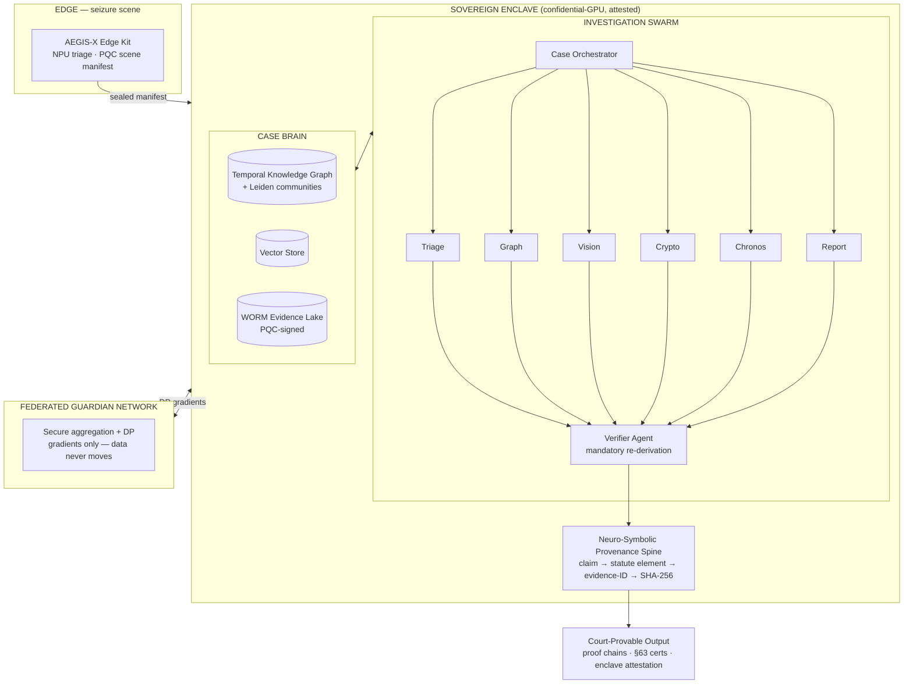

# AEGIS-X — The Elevated Blueprint (Billion-Dollar Core)
### HACK-KP 2026 · Chief-Architect Vision Document
> AEGIS proved the concept. **AEGIS-X makes every claim cryptographically verifiable and every workflow agentic.**
> Positioning: *"The sovereign intelligence fabric for child protection — from seizure scene to courtroom, provable at every step."*
> Companions: `ARCHITECTURE.md` (base LLD) · `DEMO-ILLUSION.md` (mock spec) · `research\frontier-ai.md`, `security-frontier.md`, `business-case.md`

---

## 🗣️ In plain words
- AEGIS was version 1; **AEGIS-X** is the upgraded, bigger-ambition version pitched as a billion-dollar company.
- The upgrade in one sentence: don't just say "trust our AI" — hand over *mathematical proof* that every AI claim traces back to sealed evidence.
- New ideas: a *team* of AIs that check each other's work; a "proof chain" a prosecutor can show in court; computer chips that certify what software ran on them.
- Agencies worldwide can make the shared AI smarter *without ever sharing a single file* — like chefs swapping recipe tips, never ingredients.
- A field kit starts the evidence trail at the suspect's doorstep, before devices even reach the lab.
- Every term here (enclave, federated learning, peel chain…) is decoded in `LAYMAN-GUIDE.md`.

## 1. The Elevation Thesis (one paragraph for the pitch)
Every incumbent owns one lane — Cellebrite (devices), Chainalysis (crypto), Clearview (faces), Palantir (ontology), Thorn (hashes). Cellebrite even shipped "agentic AI" in Guardian (2025). The whitespace no one occupies is the **combination**: a **sovereign, air-gapped, agentic, court-provable fusion fabric**. AEGIS-X is that box. Its moat is not any single model — it's the **neuro-symbolic provenance spine** that turns AI output into cross-examination-proof evidence, and the **federated network effect** that makes every new agency deployment improve detection for all others without a single file crossing a border.

---

## 2. AEGIS-X Core: Six Elevations over AEGIS v1

### E1 — The Investigation Swarm (agentic orchestration)
- **Tech:** LangGraph-style plan→act→verify graphs over local LLMs (Llama 3.x/DeepSeek-R1 on-prem). A **Case Orchestrator** decomposes objectives into missions for specialist agents: `Triage-Agent, Graph-Agent (Cypher), Vision-Agent, Crypto-Agent, Chronos-Agent, OSINT-Agent, Report-Agent`.
- **The differentiator:** a mandatory **Verifier Agent** — no claim reaches an investigator until it is re-derived against raw evidence; every reasoning trace is persisted to the audit log (courts can replay the AI's "thought process").
- **Autonomy tiers:** T0 suggest-only → T1 auto-run pre-approved playbooks → T2 overnight autonomous case-sweep ("while you slept, AEGIS-X found 3 leads"). Human approval gates between tiers.
- **Demo mock:** the agent-trace drawer (already in prototype) + a "Overnight Sweep Report" card on the dashboard: "Swarm ran 214 missions · 3 new leads · 0 hallucinations (all claims verified)".

### E2 — Temporal GraphRAG (the case brain)
- **Tech:** Microsoft-GraphRAG-style pipeline: entity/relation extraction → **temporal knowledge graph** (edges carry validity intervals) → Leiden community detection → pre-computed community summaries → hybrid vector+graph retrieval.
- **Why it beats chunk-RAG:** "connect-the-dots" whole-case questions ("how are these three suspects linked?") need graph traversal + community summaries, not top-k chunks. Time-scoped queries ("who did Subject-B talk to *before* the wallet was created?") need temporal edges.
- **Demo mock:** Ask AEGIS answers cite both `chunk` citations AND a mini graph-path visual ("answer derived from path: Subject-A →TRANSACTED→ wallet bc1q…7f9 →PEEL→ Subject-C").

### E3 — Neuro-Symbolic Provenance Spine (the legal moat)
- **Tech:** every AI claim is compiled into a symbolic assertion `claim(fact, rule_id, evidence_ids[], model_version, confidence)` checked by a rules engine (legal ontology: BSA 2023, IT Act, POCSO elements-of-offence). Output = a **proof chain**: fact → statute element → evidence ID → SHA-256.
- **Effect:** the prosecutor doesn't present "the AI said so" — they present a machine-generated *derivation* where every leaf is a hash-sealed exhibit. Nobody ships this for CSAM investigation. **This is the billion-dollar moat.**
- **Demo mock:** in Court Report, each finding row expands into a proof tree: `POCSO §14 element "production" ← FILE-2291 (SHA-256 ✓) + EXIF device-serial match (DEV-01) + timeline event T-114`.

### E4 — Verifiable Compute (trust by silicon, not by promise)
- **Tech:** all inference runs inside **confidential-GPU enclaves** (NVIDIA H100/Blackwell CC mode, Intel TDX/AMD SEV-SNP hosts). Enclaves emit remote attestations — silicon-signed proof of *exactly which model weights processed which evidence*.
- Plus: **ZK membership proofs** ("this hash ∈ known-CSAM DB" without revealing content), **FHE encrypted hash-matching** against NCMEC/IWF lists, and **hybrid PQC signatures (ML-DSA + ECDSA)** on evidence archives — defeats "harvest-now-forge-later" for cases that reach court in 2035+.
- **Demo mock:** status bar gains "Enclave Attestation: VERIFIED ✓ (NVIDIA CC · measurement 0x7f3a…)"; report gains a "Cryptographic Verification" appendix with attestation + PQC signature block.

### E5 — Federated Guardian Network (the network effect)
- **Tech:** cross-agency **federated learning** with secure aggregation + differential privacy: each agency trains locally on its lawful data; only DP-noised gradients aggregate. The shared zero-day detector improves with every deployment — **0 files ever cross a border**. Solves DPDP/GDPR/no-adequacy walls.
- **Business translation:** classic data-network-effect moat (the Flock Safety pattern → 25× revenue multiple). Agency #200 gets a detector trained by the experience of 199 others.
- **Demo mock:** dashboard widget "Guardian Network: 23 agencies · model v14 · your contribution: +0.8% recall · last sync 02:14 (gradients only — no data left premises)".

### E6 — Edge-to-Courtroom Continuum
- **Tech:** **AEGIS-X Edge** — NPU field kit (Jetson/Snapdragon-class) at the seizure scene: known-hash triage, on-device apparent-age screen, C2PA validation — offline, before devices even reach the lab. Chain of custody begins at the doorstep with a PQC-signed scene manifest.
- **Video-native search** in the lab: open-vocabulary grounding ("find every frame with a red backpack"), voice-clone detection, speaker ID — hours of traumatic review → seconds, blur-by-default.
- **Synthetic Shield v2:** C2PA provenance check → SynthID/watermark scan → diffusion-artifact detector → 3-stream ensemble; *broken provenance* is itself a forensic signal fused into Chronos.
- **Demo mock:** an "Edge Kit" card on the dashboard ("Scene manifest E-KIT-07 sealed 11:42, 4,112 files pre-triaged at scene"); a video-search bar in Triage with a canned "red backpack — 3 frames found" result.

---

## 3. AEGIS-X Reference Architecture

---

## 4. Billion-Dollar Frame (from `business-case.md`)

| Scenario | Agencies × ACV | ARR | Multiple | Valuation |
|---|---|---|---|---|
| Conservative | 200 × $500k | $100M | 10× | **$1.0B** |
| Base | 300 × $500k | $150M | 12× | **$1.8B** |
| Growth (network effect) | 500 × $800k | $400M | 15–25× | **$6B+** |

- Anchors: Cellebrite $480.8M ARR (~6× floor) · Magnet→Thoma Bravo $1.3B (~8–9×) · Flock Safety $7.5B on $300M ARR (~25×, network-effect ceiling — **our E5 pattern**).
- TAM ≈ $36B+ (digital forensics $22.8B by 2030 + lawful intercept $13B+). India alone: 36+ state forces, 15–20 central agencies, 600+ cyber cells.
- GTM: Kerala cyber cell pilot → I4C/CCTNS national (Nirbhaya Fund ₹131.6cr cyber, I4C ₹415.86cr) → INTERPOL/ICSE international.
- Impact economics: ~$210–250k lifetime cost per survivor (CDC), $4–6 social ROI per $1.

## 5. Five Moats (say these in the pitch)
1. **Provenance spine** — the only court-provable AI reasoning chain in the category.
2. **Federated network effect** — every deployment improves everyone; data never moves.
3. **Regulatory embedding** — BSA §63/POCSO ontology + GeM procurement = India home-field.
4. **Verifiable compute** — silicon-attested inference; competitors ask for trust, we hand over proof.
5. **Wellbeing certification** — measurable exposure-reduction KPI; procurement differentiator + retention.

## 6. Honesty Ledger (for judge Q&A)
Production-ready today: confidential GPUs, C2PA, PQC (FIPS 203/204), GraphRAG, LangGraph swarms, local LLMs.
Early-pilot / roadmap: cross-agency FL for CSAM, ZK/FHE hash-matching at scale, T2 autonomous sweeps.
Demo: working console; inference simulated (Wizard-of-Oz per `DEMO-ILLUSION.md`); architecture research-validated.

## 7. What flows into the deliverables
| Deliverable | Injection |
|---|---|
| Prototype | E1 trace drawer ✅ (in progress) + E4 attestation badge + E5 Guardian Network widget + E3 proof-tree in report + E6 edge-kit card & video-search bar |
| Deck | New slides: "The Whitespace" (lanes chart), "Provenance Spine" (proof chain), "Guardian Network" (federation map), "Billion-Dollar Math" (table above) |
| Video | Elevate close: "…and every deployment makes every other agency stronger — without a single file leaving home." |
